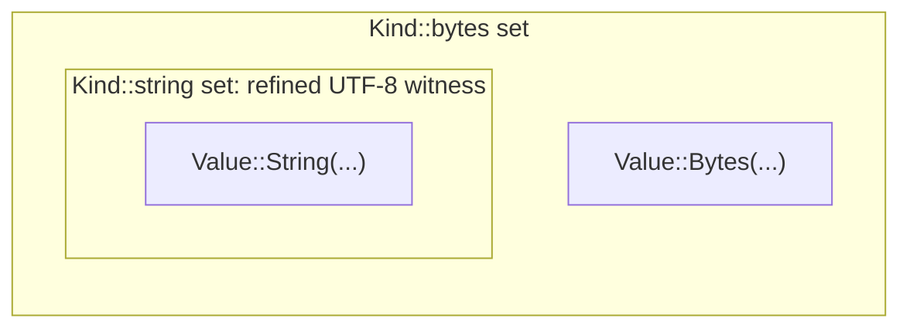
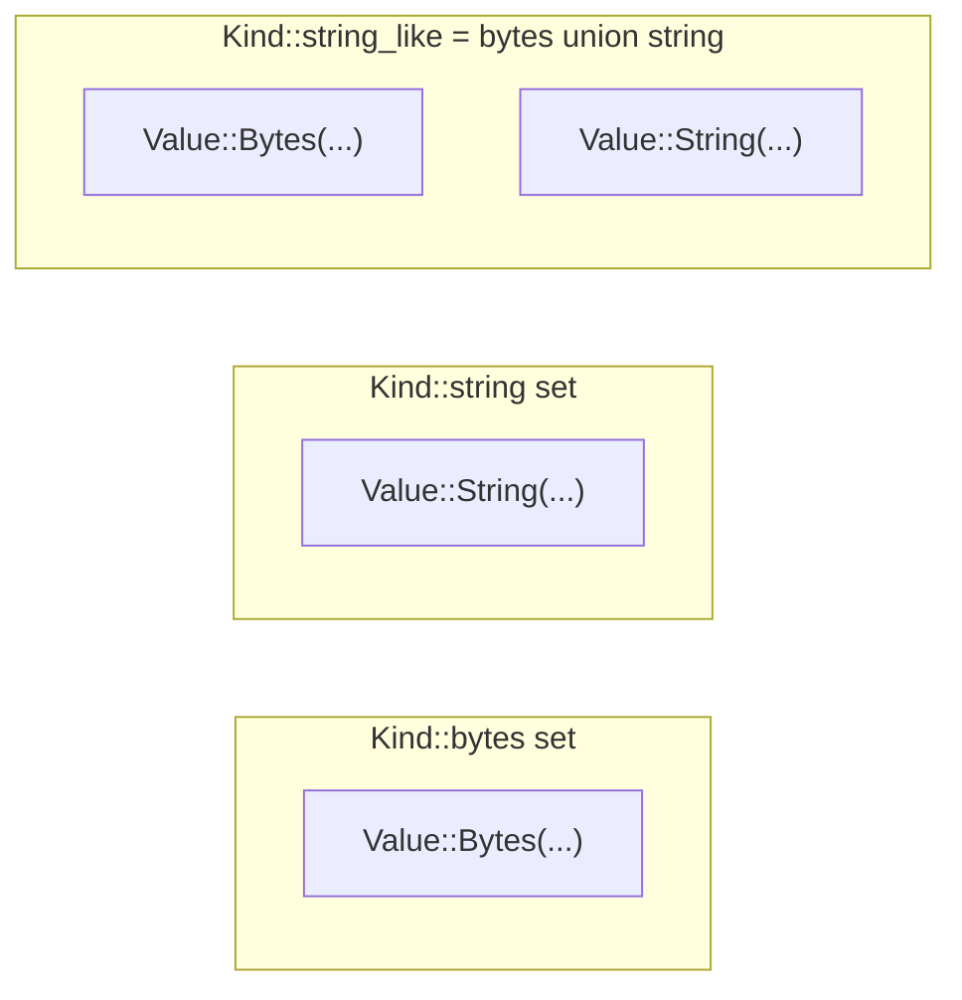

# RFC 2026-05-01 - Add `Value::String` Variant for Guaranteed-UTF-8 Strings

## Context

The `Value` enum in [src/value/value.rs](../src/value/value.rs) currently uses a single `Bytes(bytes::Bytes)` variant for both raw byte data and UTF-8 strings. This works but conflates two distinct concepts:

1. **Raw byte sequences** -- produced by network reads, decryption, random-bytes generation, binary protocol fields, and the output of compression/encryption stdlib functions. May or may not be valid UTF-8.
2. **Guaranteed-UTF-8 strings** -- produced by VRL source string literals, JSON deserialization, parsed log/CSV/key-value fields, grok captures, and stdlib functions whose output is valid UTF-8 by construction (hex, base64-encoded text, hashes, UUIDs, casing operations).

Conflating them has costs:

- Every operation that wants to treat a value as a string must perform a UTF-8 validation pass, even when the value provably came from a UTF-8 source.
- The type system (via `Kind`) cannot distinguish "raw bytes that might or might not be UTF-8" from "definitely a UTF-8 string", so fallibility analysis on `string!` / `to_string` / etc. is uniformly conservative.

This RFC proposes adding a new `Value::String(bytestring::ByteString)` variant alongside `Value::Bytes(Bytes)`, threading guaranteed-UTF-8 sources to the new variant, and (in later phases) lifting the distinction into the `Kind` type system. The change is staged across phases so each compiles and tests independently and the breaking-change phase can be deferred indefinitely without losing the value of the earlier ones.

The [`bytestring`](https://crates.io/crates/bytestring) crate provides a `ByteString` type that wraps `bytes::Bytes` with a UTF-8 invariant -- zero-copy clones, cheap `as_str()`, and direct conversion from/to `Bytes` for interop with the existing variant.

## Goals

1. Improve the performance of UTF-8 string handling in `Value` by eliminating major classes of UTF-8 validation after bytes creation. Once a value is constructed from a guaranteed-UTF-8 source (parser literal, JSON deserialize, grok capture, parsed log/CSV/KV field, hex/base/hash output), subsequent `as_str` / display / serde / stdlib-string-op paths should be O(1) rather than re-running `from_utf8` or `from_utf8_lossy` (the more expensive of the two) on every call.
2. Preserve VRL `==` semantics: `Value::Bytes(b"foo") == Value::String("foo".into())` continues to hold (and they hash identically), so user programs see no behavior change at the equality layer.
3. Allow incremental adoption: each phase compiles standalone, tests pass at every phase boundary, and downstream consumers (notably Vector) can absorb the change without coordinated rollouts.
4. Ultimately let the type system prove "this kind has a UTF-8 witness" so `string!` / `to_string` and similar coercions can be infallible on values where the proof is available.
5. Preserve *semantic* backwards compatibility through Phase C: VRL programs and downstream consumers behave identically to today, with the variant migration mediated by the custom `PartialEq`/`Hash` and the preserved `is_bytes()` semantics. Concentrate semantic breaking changes in the optional Phase D with a clear migration story. Note that Phase A itself is a public-API source break (adding a variant to a non-`#[non_exhaustive]` enum forces downstream exhaustive-match sites to add an arm) -- this is a one-time migration handled by every downstream crate at the time it bumps the VRL dependency.

## Out of scope

1. **Removing the `Value::Bytes` variant.** Raw byte data is real (decryption output, random bytes, binary protocol fields, compression output) and continues to need a representation.
2. **Automatic UTF-8 promotion at runtime.** This RFC never silently validates `Value::Bytes` content to opportunistically promote it to `Value::String`. Promotion is always explicit (Phase A `From<&str>` redirections and the new `Value::from_utf8_or_bytes` constructor, Phase B producer migrations, Phase D `assert_string!` casts).
3. **VRL surface-language type syntax changes** (until Phase D). The user-visible "string" type label is preserved through Phase C.
4. **Performance benchmarking and tuning.** This RFC focuses on correctness and code structure. Benchmarks that quantify the win from skipping UTF-8 validation are future work.
5. **External consumer (Vector) coordination beyond Phase A's one-time match-site audit.** When downstream crates (notably Vector) bump to the VRL release that includes Phase A, every exhaustive `match` over `Value` must add a `Value::String` arm. This is the only public-API source break introduced through Phase C; semantically, all existing call sites continue to behave as before. Deeper Vector integration (e.g. emitting `Value::String` from Vector source code) is left to a follow-up.

## Proposal

### Overview

Phase A delivers the new variant and threads UTF-8 sources to it; both variants share `Kind::bytes()`. Phase B incrementally migrates the remaining UTF-8-producing sites (stdlib outputs and non-stdlib producers) to emit `Value::String`. Phase C introduces a `string` flag on `Kind` as a refinement of `bytes` (the type system can prove UTF-8). Phase D (separate, breaking) flips the relationship to disjoint kinds.

### Rationale

- **Coexist, don't replace.** `Bytes` and `String` are both first-class. Existing code keeps working.
- **Custom `PartialEq` keeps VRL semantics.** Without it, `Value::Bytes(b"foo") != Value::String("foo")` would break hundreds of equality sites and surprise users.
- **`try_bytes` chokepoint, plus a direct-match audit.** A single helper in [src/compiler/value/convert.rs](../src/compiler/value/convert.rs) is used by many stdlib files to extract bytes. Updating it to accept both variants covers those callers transparently. A separate audit covers stdlib functions that destructure `Value::Bytes(_)` directly without going through the chokepoint (e.g. `string`, `length`); each such match needs a sibling `Value::String(s)` arm before VRL literals can safely route to the new variant.
- **Refinement before disjoint.** Adding `Kind::string` as a refinement of `Kind::bytes` (Phase C) is non-breaking. Flipping to disjoint (Phase D) is breaking and should be staged separately when the team is ready.

### Phase A -- Core: introduce `Value::String`

Phase A delivers the new variant end-to-end so the codebase compiles and tests pass with `Value::String` populated by the natural UTF-8 sources. No `Kind` changes; both variants map to `Kind::bytes()`.

`Value` is a public enum without `#[non_exhaustive]` (see [src/value/value.rs](../src/value/value.rs)), so adding the variant is a public-API source break: every downstream crate with an exhaustive `match` over `Value` (notably Vector) must add a `Value::String(_)` arm when it bumps the VRL dependency. Document the migration in the VRL changelog with a `match` example for Vector and any other consumers we know of. Beyond the variant addition, no other public API breaks land in Phase A: behavior on every existing `Value` value is preserved by the custom `PartialEq`/`Hash`, and the chokepoint helpers in `vrl::compiler` continue to accept the legacy variant.

Most of the work is mechanical: add `Value::String(_)` arms to the exhaustive matches in [src/value/](../src/value/) and [src/compiler/](../src/compiler/); teach string-extracting helpers (`is_bytes`, `as_bytes`, `as_str`, `encode_as_bytes`, `coerce_to_bytes`, `to_string_lossy`) to accept either arm; and audit CRUD code in [src/value/value/crud/](../src/value/value/crud/) (mostly variant-agnostic).

There is also a less-mechanical audit task that must land in the same PR as the literal-routing change: stdlib functions that destructure `Value::Bytes(_)` directly rather than going through `try_bytes` -- known examples include [src/stdlib/string.rs](../src/stdlib/string.rs) (`string` / `string!`) and [src/stdlib/length.rs](../src/stdlib/length.rs) (`length`), and there are likely more. Each direct `Value::Bytes(b) => ...` arm needs a sibling `Value::String(s) => ...` arm (or the match must be replaced with a call to `try_bytes` / `as_str` / similar helper). Without this audit, routing VRL literals to `Value::String` would make basic calls like `string!("x")` or `length("x")` start erroring at runtime -- the chokepoint update only covers functions that already extract bytes through `try_bytes`. An exhaustive `rg "Value::Bytes\(" src/stdlib/` is the entry point; expect the result list to drive the per-function arm additions.

The non-obvious specifications are below.

The new variant in [src/value/value.rs](../src/value/value.rs):

```rust
/// UTF-8 string (guaranteed valid).
String(bytestring::ByteString),
```

Drop the derived `PartialEq`/`Eq`/`Hash` and implement them manually so `Bytes` and `String` of equal byte content compare equal and hash identically. All other variants retain the behavior of the current derived impls.

```rust
impl PartialEq for Value {
    fn eq(&self, other: &Self) -> bool {
        match (self, other) {
            (Self::Bytes(a), Self::Bytes(b)) => a == b,
            (Self::String(a), Self::String(b)) => a == b,
            (Self::Bytes(a), Self::String(b)) | (Self::String(b), Self::Bytes(a)) => {
                a.as_ref() == b.as_bytes()
            }
            // all other variants: compare the discriminant, then the inner value
            ...
        }
    }
}
```

`Hash` must give `Value::Bytes` and `Value::String` the same hash for byte-equal content; the other variants retain their current (derived) behavior. The simplest implementation hashes the same discriminant byte for both string-y variants and delegates to the derived discriminant scheme for the rest:

```rust
impl Hash for Value {
    fn hash<H: Hasher>(&self, state: &mut H) {
        match self {
            // Bytes and String share a discriminant byte and hash their
            // contained bytes directly, so byte-equal values hash identically.
            Self::Bytes(b)  => { 0u8.hash(state); b.as_ref().hash(state); }
            Self::String(s) => { 0u8.hash(state); s.as_bytes().hash(state); }
            // Every other variant: hash std::mem::discriminant + inner value,
            // matching what derive(Hash) produced before.
            other => {
                std::mem::discriminant(other).hash(state);
                match other { ... }
            }
        }
    }
}
```

`PartialOrd::partial_cmp` likewise compares `Bytes` and `String` by byte content -- it must not short-circuit on discriminant for that pair.

`From<&str>`, `From<String>`, `From<Cow<'_, str>>`, `From<KeyString>`, and a new `From<ByteString>` produce `Value::String`. `From<Bytes>`, `From<&[u8]>`, `From<[u8; N]>`, and `From<&[u8; N]>` keep producing `Value::Bytes` (callers who hold a `Bytes` known to be UTF-8 must construct a `ByteString` themselves to opt into the new variant). For the case where the caller has a `Bytes` and wants to opportunistically promote it, add an infallible constructor `Value::from_utf8_or_bytes(b: Bytes) -> Value`: if the bytes are valid UTF-8 the result is `Value::String`, otherwise `Value::Bytes`. The caller never has to handle an error and never re-allocates -- the validation either succeeds (the `Bytes` is moved into the new `ByteString` zero-copy) or the original `Bytes` is wrapped in `Value::Bytes` directly.

`From<&Value> for Kind` maps the new variant to `Kind::bytes()` -- no new `Kind` flag in Phase A.

`Value::merge` and `try_add` (string concat) follow the rule `String + String` -> `String`, any mixed pair -> `Bytes`. `try_mul` (string repeat) preserves the operand's variant. Comparisons (`try_gt`/`ge`/`lt`/`le`, `eq_lossy`) compare byte-wise across variants. The `is_bytes() && is_bytes() => infallible` invariant in [src/compiler/expression/op.rs](../src/compiler/expression/op.rs) is preserved because `is_bytes()` returns true for both variants.

Update `VrlValueConvert::try_bytes` and `try_bytes_utf8_lossy` in [src/compiler/value/convert.rs](../src/compiler/value/convert.rs) to extract `&[u8]` from either variant:

```rust
fn try_bytes(self) -> Result<Bytes, ValueError> {
    match self {
        Value::Bytes(b) => Ok(b),
        Value::String(s) => Ok(s.into_bytes()),
        v => Err(...),
    }
}
```

This update covers every stdlib function that already extracts bytes via `try_bytes`. Functions that match `Value::Bytes(_)` directly are handled by the per-function audit described above.

Change `expression::Literal::String` in [src/compiler/expression/literal.rs](../src/compiler/expression/literal.rs) to wrap `ByteString` instead of `Bytes`, and update `compile_literal` in [src/compiler/compiler.rs](../src/compiler/compiler.rs) to construct `ByteString::from(s)` from the lexer's UTF-8-guaranteed string and template-string literals.

`Value::String`'s `Display` arm shares the same escape-and-quote rendering as the existing `Bytes` arm in [src/value/value/display.rs](../src/value/value/display.rs) (escape `\\`, `"`, and `\n`; wrap in `"`). The only difference is that the `String` arm starts from a `&str` directly and skips the leading `String::from_utf8_lossy` step. Concretely, factor the escape-and-quote logic into a helper that takes `&str` and call it from both arms. Output must be byte-identical to the `Bytes` arm when the bytes are valid UTF-8, so snapshot tests that round-trip through `Display` stay stable across the variant migration.

Serde routing honors the source format's distinction: `visit_str` / `visit_string` / `visit_borrowed_str` -> `Value::String`; `visit_bytes` / `visit_byte_buf` -> `Value::Bytes` (CBOR/MessagePack distinguish, honor the source); `serde_json::Value::String` -> `Value::String`; `Value::String` serializes via `serialize_str`.

The quickcheck/proptest `Arbitrary` impl produces both variants randomly: random UTF-8 strings -> `Value::String`, random byte arrays -> `Value::Bytes`.

### Phase B -- Migrate UTF-8 producers to `Value::String` (incremental)

Inputs across the codebase already accept both variants by the time Phase B starts: Phase A's combination of the `try_bytes` chokepoint update and the direct-match audit ensures every stdlib function tolerates `Value::String` input. This phase is purely about tightening output construction sites. The work is incremental: each producer (or small group) can land as its own PR, and the phase can stop at any point if priorities shift -- the variant remains correct and unmigrated producers continue to emit `Value::Bytes`.

Start with the stdlib that construct `Value::Bytes(...)` directly. Producers whose output is UTF-8 by construction migrate to emit `Value::String`:

- String ops (UTF-8 in -> UTF-8 out): `string`, `slice`, `find`, `replace`, `length`, `split`, `redact`, `downcase`, `upcase`, `truncate`, `strip_whitespace`.
- Decoders/parsers producing text: `decode_charset`, `decode_percent`, `parse_*` (log/CSV/key-value/user-agent/timestamp).
- Hex/Base/UUID/hash producers (ASCII output): `encode_base64`, `encode_base16`, `sha2`, `sha3`, `xxhash`, `crc`, `community_id`, `hmac`, `uuid_v4`, `uuid_v7`.

Producers of arbitrary bytes stay on `Value::Bytes`: `random_bytes`, `encrypt`, `decrypt`, raw compression (`encode_gzip`/`zlib`/`zstd`/`lz4`/`snappy`), and binary `decode_*` (notably `decode_base64`, which decodes to arbitrary bytes -- not guaranteed UTF-8).

Then sweep the remaining non-stdlib producers: grok captures in [src/datadog/grok/](../src/datadog/grok/), protobuf `string` fields in [src/protobuf/parse.rs](../src/protobuf/parse.rs) (proto `bytes` fields stay `Value::Bytes`), and parsed strings in [src/parsing/ruby_hash.rs](../src/parsing/ruby_hash.rs) and [src/parsing/xml.rs](../src/parsing/xml.rs). Protobuf encode in [src/protobuf/encode.rs](../src/protobuf/encode.rs) is input-only and already routes through `try_bytes` -- no construction-site changes expected.

### Phase C -- `Kind::string` as a refinement of `Kind::bytes`

Phases A-B left both variants sharing `Kind::bytes()`. Phase C adds a `string` flag to `Kind` that acts as a refinement guarantee -- "this kind has a UTF-8 witness" -- without removing the `bytes` flag. The set of values described by `Kind::string` is a subset of those described by `Kind::bytes`:



The new flag in [src/value/kind.rs](../src/value/kind.rs):

```rust
pub struct Kind {
    bytes: Option<()>,
    string: Option<()>,   // NEW: refinement; string=Some implies bytes=Some
    integer: Option<()>,
    ...
}
```

The refinement invariant -- `string=Some` implies `bytes=Some` -- is enforced by `canonicalize`: if `output.string.is_some()`, ensure `output.bytes = Some(())`. Every `Kind` flowing through canonicalization satisfies the invariant unconditionally; constructors and mutators (`Kind::string()`, `add_string`, `or_string`, `remove_bytes`) maintain it directly.

The `Kind::string()` constructor sets both flags; `From<&Value> for Kind` now maps `Value::String(_)` to `Kind::string()` and `Value::Bytes(_)` to `Kind::bytes()`. The existing `is_bytes()` / `contains_bytes()` predicates keep their meaning unchanged -- they check the `bytes` flag, which is set for both unrefined-bytes kinds and refined-string kinds -- so the dozens of existing call sites and the `is_bytes() && is_bytes() => infallible` invariant in [src/compiler/expression/op.rs](../src/compiler/expression/op.rs) continue to work without modification. Two new predicates land for code that wants to prove UTF-8: `contains_string()` (true iff `self.string.is_some()`) and `is_only_string()` (true iff the kind is exactly the refined-string kind).

The user-visible label remains `"string"` in `Display` -- refined and unrefined kinds render identically (the user already calls both "string" today). The refinement may surface in `Debug` output (e.g. `"bytes (utf8)"`).

Merging two kinds preserves the existing OR semantics for the `bytes` flag (and for every other base flag): `Kind::bytes() | Kind::null()` keeps the `bytes` flag, `Kind::string() | Kind::null()` keeps both `bytes` and `string` flags (so an optional refined-string remains a refined-string -- the null branch contributes no string-y values and so cannot dilute the witness), and so on. The refinement is dropped only when *both* sides could produce string-y values and at least one side is unrefined: `Kind::bytes() | Kind::string()` produces a kind with `bytes` set but `string` cleared, because the `bytes`-only branch could yield a `Value::Bytes` we have no UTF-8 witness for. Concretely:

```
merged.bytes  = a.bytes  || b.bytes      // OR, as today
merged.string = match (a.bytes, b.bytes) {
    (None,    None)    => None,          // neither branch is string-y; nothing to refine
    (Some(_), None)    => a.string,      // only a is string-y; preserve a's refinement
    (None,    Some(_)) => b.string,      // only b is string-y; preserve b's refinement
    (Some(_), Some(_)) => a.string && b.string,  // both string-y; survive only if both refined
}
```

The same rule applies to any other refinement flag added in the future: a refinement survives a merge iff every branch that contributes to the base flag also carries the refinement.

The result type of string concat (`+`) follows the same rule: both operands `is_only_string()` -> `Kind::string()` (refinement preserved); any other string-like combination -> `Kind::bytes()` (refinement dropped, matching the Phase A runtime rule). `try_mul` (string repeat) preserves the operand's refinement. Comparisons (`<`, `>`, `<=`, `>=`) require only `is_bytes()` and are unaffected.

Stdlib output `TypeDef` polish is optional and incremental, and overlaps with Phase B's runtime migrations: tighten outputs to `Kind::string()` for the same producer set (string ops, decoders/parsers producing text, hex/base/UUID/hashes); keep `Kind::bytes()` for raw producers. Inputs require no change because `is_bytes()` still admits both variants.

Tightened outputs unlock the fallibility wins. `string!` (in [src/stdlib/string.rs](../src/stdlib/string.rs)) and any other coercion that today does runtime UTF-8 validation become infallible only when the input `is_only_string()` -- i.e., the kind is exactly the refined-string kind with no other variants admitted -- and stay fallible otherwise. `contains_string()` is too permissive: a kind like `Kind::string() | Kind::null()` retains the `string` refinement under the merge rule (the null branch contributes no string-y values and so cannot dilute the witness), but `string!` on that kind would still error at runtime when the value happens to be null. The predicate must therefore reject any kind that admits a non-string variant. The fallible form's output type is `Kind::string()`, so calling it once promotes the kind for the rest of the program flow. Phase C does not modify the fallibility analysis of any function other than the UTF-8-witness coercions described above. In particular, `to_string` (see [src/stdlib/to_string.rs](../src/stdlib/to_string.rs)) keeps its existing rule -- fallible when the input kind could be an array, object, or regex (`maybe_fallible(td.contains_array() || td.contains_object() || td.contains_regex())`), infallible otherwise. The only Phase C-eligible polish for `to_string` is tightening its declared output `TypeDef` from `Kind::bytes()` to `Kind::string()`, since the success path is UTF-8 by construction; the audit in Phase D (or earlier opt-in polish) handles that tightening on its own schedule. Document: "operations that require a UTF-8 witness are infallible only when the input kind admits no variants other than the refined string; merely containing the refinement in a union is not enough."

Backwards compatibility: zero source changes required in Phase C itself for VRL programs or external consumers, because `is_bytes()` semantics are preserved -- this is the linchpin. The Phase A variant-addition match-site audit was a one-time cost that's already paid for downstream crates by the time Phase C lands. Existing `vrl_test_framework` fixtures asserting `kind: bytes` continue to pass since `is_bytes()` is still true for refined-string kinds. New property tests should cover the refinement invariant (`Kind::string().contains_bytes()` is true; `Kind::bytes().union(Kind::string()).contains_string()` is false), the `Value -> Kind` roundtrip, and the asymmetric merge rule.

### Phase D -- Flip to disjoint kinds (future migration, optional, breaking)

Phase D completes the migration started in Phase C by removing the refinement relationship: `Kind::bytes` and `Kind::string` become disjoint sets:



This is a backwards-incompatible change and should be staged as a separate release. Phase D is deliberately optional: the team can stay on Phase C indefinitely if the breaking change is unwelcome.

The flip is concentrated in two places. `Kind::string()` is redefined to set only the `string` flag (no longer also `bytes`); `From<&Value> for Kind` follows. `canonicalize` no longer enforces the Phase C refinement invariant -- the two flags are now independent. A new constructor `Kind::string_like()` returning `bytes | string` becomes the "any string-y input" type that most stdlib parameters need to widen to. `Display::fmt` renders `bytes` and `string` as separate user-facing labels so diagnostics directly reflect the kind algebra.

`is_bytes()` is redefined to "exactly raw bytes, not UTF-8 string" -- it now returns false on a kind that previously satisfied it under Phase C. Two new predicates land alongside it: `is_string_like()` (true iff exactly `bytes`, exactly `string`, or `bytes | string`) and `contains_string_like()` (true iff `contains_bytes() || contains_string()`).

The largest task in Phase D is the stdlib parameter audit. Add a constant `pub const STRING_LIKE: u16 = BYTES | STRING;` in the kind bitmask module, then sweep all `Kind::bytes()` parameter declarations across [src/stdlib/](../src/stdlib/) and [src/compiler/function.rs](../src/compiler/function.rs). The decision matrix is:

- Input (parameter): widen to `STRING_LIKE` unless the function genuinely refuses string input. Most won't.
- Output (`TypeDef`): tighten to `Kind::string()` for UTF-8 producers (already mostly done in Phase C). Keep `Kind::bytes()` for raw producers (`random_bytes`, encryption, raw compression, binary decode).

Any function still declaring `Kind::bytes()` after this audit is asserting "I do not accept string inputs" -- verify that's intentional.

The infallibility check in [src/compiler/expression/op.rs](../src/compiler/expression/op.rs) breaks under disjoint semantics -- a `Value::String` argument has `Kind::string`, so `is_bytes()` is false, so the type system would think string concat is fallible. Replace with `is_string_like()`:

```rust
if lhs_def.is_string_like() && rhs_def.is_string_like() { /* infallible */ }
```

Every `is_bytes()` call site in [src/compiler/](../src/compiler/) needs the same audit. The string-concat result type also splits: `string + string` -> `string`, `bytes + bytes` -> `bytes`, mixed -> `string_like` (the disjoint version of Phase C's "drops to `Kind::bytes`").

Phase A's custom `PartialEq` is kept: `Value::Bytes(b"x") == Value::String("x")` continues to hold at the value level even though their kinds are now disjoint. Document explicitly: "Value-level `==` is structural over byte content and crosses kind boundaries; `Kind`-level equality is over the type-system algebra." VRL `==` continues to work uniformly, minimizing user surprise.

Coercion gains real teeth. `string!` on `Kind::bytes` is now guaranteed fallible (the type system promises the input is not known UTF-8); on `Kind::string` it is infallible; on `Kind::string_like` it remains fallible (input might be the bytes branch). Introduce a new `assert_string!` macro as the explicit `Kind::bytes -> Kind::string` cast: runtime UTF-8 validation, output type `Kind::string`. Existing `to_string` / `to_string!` keep their current generic-stringification semantics unchanged for source compatibility -- they are not aliased to `assert_string!`. Where a refinement-aware variant of an existing operation is useful, expose a new method rather than altering the existing one.

The `vrl_test_framework` type-spec syntax exposes `bytes` as a distinct annotation: `kind: bytes` vs `kind: string` vs `kind: string_like`. Existing fixtures pinning `kind: bytes` for a string operation update to `kind: string` or `kind: string_like` -- expect heavy churn here. `Kind::Display` snapshot tests change too because of the precise label rendering.

A user-facing migration guide is required, with `assert_string!(...)` cast examples for each new type-error class. Major-version changelog: "BREAKING: `Kind::bytes` and `Kind::string` are now disjoint." Coordinate Vector's rollout.

Backwards compatibility: this is the breaking-change phase, by design. VRL programs that rely on `Kind::bytes()` accepting string literals (which Phase A produces) will need explicit casts. External consumers (notably Vector) using `Kind::bytes()` directly likewise. Major version bump strongly recommended.

Open questions, to resolve before scheduling Phase D:

1. Is the team willing to take the breaking change? If not, stay on Phase C indefinitely.
2. Should `decode_base64`-style functions (binary decode) emit `Kind::bytes` or `Kind::string_like`? (Recommended: `Kind::bytes` -- base64 decodes to arbitrary bytes; let users `assert_string!` if they want UTF-8.)
3. Should there be an automatic UTF-8 widening rule (e.g. `Kind::bytes -> Kind::string` if content happens to be UTF-8)? (Recommended: no -- too expensive at runtime; require explicit `assert_string!`.)

## Alternatives

### Stop after Phase B -- never touch `Kind`

Deliver Phases A-B only: introduce `Value::String`, route UTF-8 producers, tighten stdlib outputs; both variants continue to map to `Kind::bytes()` indefinitely. This captures the runtime efficiency wins (skip-validation in hot paths) without any type-system churn. Rejected as the final stopping point because it forfeits the type-system fallibility wins -- `string!` / `to_string` / `parse_*` remain uniformly fallible regardless of how the value was produced, and the compiler cannot statically prove UTF-8 even when the variant carries the witness. Phase C is non-breaking and modestly scoped, so the cost-benefit clearly favors including it.

### Skip Phase C, go directly to disjoint kinds

Land Phases A-B, then jump straight to Phase D without staging through the refinement phase. Rejected because Phase C delivers the new flag, predicates, builder API, merge rules, and asymmetric merge invariant with no additional source breakage beyond what Phase A already incurred: `is_bytes()` semantics are preserved (refined-string kinds still satisfy it), the stdlib parameter audit becomes optional polish, and Phase A's custom `PartialEq` and refinement reinforce each other (equal values, overlapping kinds). Going straight to Phase D lands the breaking change without an intermediate state to validate the design, and forfeits a non-breaking delivery vehicle for the new machinery. If Phase D later reveals a design problem the team can stay on Phase C indefinitely; conversely if Phase D is never scheduled, Phase C's fallibility wins on `string!` / `to_string` are still independently useful.

### Make `Bytes(b"x")` and `String("x")` compare unequal at the value level

Keep the derived `PartialEq`/`Hash` on `Value` so distinct variants are always unequal even with identical byte content. Rejected because hundreds of existing test sites and an unknown number of user-facing VRL programs rely on equality working uniformly across sources -- Phase A's transition would break every fixture that uses `Value::from("foo")` (now `Value::String`) but compares against a value that arrived as `Value::Bytes` (e.g. through a deserialize path that wasn't yet re-routed). The user-visible failure mode -- `"foo" == "foo"` becoming false depending on origin -- is unacceptable. Custom `PartialEq` and `Hash` (so byte-equal values hash identically) is the only way to keep VRL `==` semantics uniform across the variant split.

### Keep VRL string literals as `Value::Bytes`

Stop short of changing [src/compiler/expression/literal.rs](../src/compiler/expression/literal.rs) and [src/compiler/compiler.rs](../src/compiler/compiler.rs); only library-internal sources (JSON deserialize, grok, parsers) emit `Value::String`. Rejected because VRL literals are guaranteed UTF-8 by the lexer and are the cheapest, highest-impact source -- emitting them as `Value::String` propagates the refinement to user-written string ops automatically. With this alternative, `"foo" + parse_json!(input).field` would produce `Value::Bytes` even when the right side is `Value::String`, dropping the refinement Phase C wants to track and starving the new variant of its most natural input.

### Phase D label rendering -- keep both kinds as `"string"`

In Phase D's disjoint regime, render `Kind::bytes` and `Kind::string` both as `"string"` in user-facing diagnostics (matching today's behavior). Rejected because it defeats the point of disjoint kinds: users reading "expected string, got integer" cannot tell whether the function accepts raw bytes, refined string, or the union, and have no guidance for adding the right `assert_string!` cast. The RFC recommends precise labels (`"string"` and `"bytes"` separately) so diagnostics directly reflect the kind algebra.

### Phase D `PartialEq` -- tighten to discriminant-aware equality

In Phase D, change `Value`'s custom `PartialEq` so `Bytes(b"x") != String("x")` to align runtime equality with the now-disjoint type system. Rejected for the same reason as the broader value-level inequality alternative above: it breaks existing equality sites and loses the uniform `==` semantics established in Phase A. Document instead that "value-level `==` is structural over byte content and crosses kind boundaries; `Kind`-level equality is over the type-system algebra."

## Implementation plan

One checkbox per planned PR. Later PRs depend on earlier ones in listed order.

- [ ] Phase A -- Add `Value::String(ByteString)` variant. Single PR landing the new variant, custom `PartialEq`/`Hash`, conversions, display, serde, arithmetic, parser-literal routing, the `try_bytes` chokepoint update, and the stdlib direct-match audit (every `Value::Bytes(_)` arm in [src/stdlib/](../src/stdlib/) gains a sibling `Value::String(_)` arm or is rewritten to use `try_bytes`). Must land atomically -- intermediate states will not compile, and tests will only pass once the audit is complete. Public-API source break: downstream crates (notably Vector) need to add a `Value::String(_)` arm to every exhaustive match over `Value` when bumping the VRL dependency; flag in the changelog.
- [ ] Phase B -- Migrate UTF-8 producers to `Value::String` (incremental). Start with stdlib output upgrades (string ops, text-producing decoders/parsers, ASCII producers like hex/base/UUID/hashes), then sweep non-stdlib producers (grok captures, protobuf string fields, ruby_hash, xml). Each producer (or small group) can land as its own PR; the phase can stop at any point without rolling back. No public-API changes.
- [ ] Phase C -- Add `Kind::string` as a refinement of `Kind::bytes`. Single PR landing the `string` flag with `string => bytes` canonicalization invariant, the refinement-aware merge rule (refinement survives unless a string-y branch is unrefined), new predicates (`contains_string`, `is_only_string`), tightened output `TypeDef`s, and infallibility wins on `string!`. Backwards-compatible.
- [ ] Phase D -- Flip to disjoint kinds (breaking, deferred). Resolve the three Phase D open questions, then deliver as a coordinated major-version release: redefine `is_bytes()`, add `Kind::string_like()`, audit stdlib parameters, migrate compiler infallibility checks, ship user migration guide and changelog. Likely splits internally into 2-3 PRs (type-system flip, stdlib audit, user-facing changes). Optional -- do not start until the team signs off on the breaking change.

## Future work

- **Performance benchmarking.** Quantify the win from skipping UTF-8 validation in hot paths (logging pipelines, JSON-heavy transforms). Phases A-B give a reasonable baseline; Phase C's `string!` infallibility is the most likely place to see measurable gains.
- **Vector integration.** Have Vector emit `Value::String` from its source code where appropriate (e.g. log message fields parsed from UTF-8 inputs). Out of scope for this RFC.
- **Per-stdlib-function migration tracking.** Phase B is incremental; a tracking issue listing which functions have been migrated would help coordinate the work.
- **Schema integration.** Vector's config-time schema/type checking (currently keyed on `Kind::bytes`) could be tightened to `Kind::string` for fields that are documented as strings, gaining stronger config validation.
- **Direct `bytes::Bytes <-> ByteString` conversions** in performance-critical paths to avoid round-tripping through `Vec<u8>`.

## References

- [`bytestring` crate](https://crates.io/crates/bytestring) -- UTF-8 wrapper around `bytes::Bytes`.
- [`bytes` crate](https://crates.io/crates/bytes) -- current `Value::Bytes` storage.
- [src/value/value.rs](../src/value/value.rs) -- current `Value` enum definition.
- [src/value/kind.rs](../src/value/kind.rs) -- current `Kind` type system.
- [src/compiler/value/convert.rs](../src/compiler/value/convert.rs) -- `VrlValueConvert::try_bytes` chokepoint used by stdlib files.
- [src/compiler/value/arithmetic.rs](../src/compiler/value/arithmetic.rs) -- runtime `+`, `*`, comparison ops on string values.
- [src/compiler/expression/op.rs](../src/compiler/expression/op.rs) -- type-level infallibility analysis for arithmetic.
- [src/compiler/expression/literal.rs](../src/compiler/expression/literal.rs) -- VRL string literals (currently produce `Value::Bytes`).
