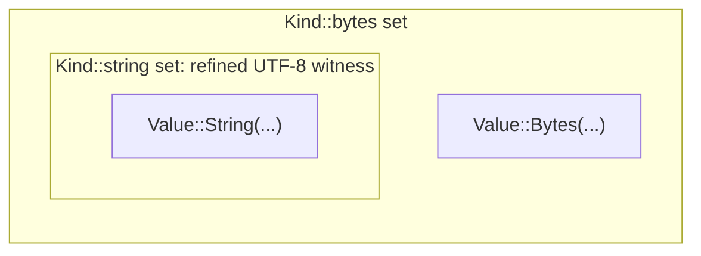

# RFC 2026-05-01 - Add `Value::String` Variant for Guaranteed-UTF-8 Strings

## Context

The `Value` enum in [src/value/value.rs](../src/value/value.rs) currently uses a single `Bytes(bytes::Bytes)` variant for both raw byte data and UTF-8 strings. This works but conflates two distinct concepts:

1. **Raw byte sequences** -- produced by network reads, decryption, random-bytes generation, binary protocol fields, and the output of compression/encryption stdlib functions. May or may not be valid UTF-8.
2. **Guaranteed-UTF-8 strings** -- produced by VRL source string literals, JSON deserialization, structured-log and key-value parsers that validate their input, grok captures, and stdlib functions whose output is valid UTF-8 by construction (hex, base64-encoded text, text-encoded hash digests, UUIDs, casing operations).

Conflating them has costs:

- Every operation that wants to treat a value as a string must perform a UTF-8 validation pass, even when the value provably came from a UTF-8 source.
- The type system (via `Kind`) cannot distinguish "raw bytes that might or might not be UTF-8" from "definitely a UTF-8 string", so fallibility analysis on `string!` / `to_string` / etc. is uniformly conservative.

This RFC proposes adding a new `Value::String(bytestring::ByteString)` variant alongside `Value::Bytes(Bytes)`, threading guaranteed-UTF-8 sources to the new variant, and (in later phases) lifting the distinction into the `Kind` type system. The change is staged across phases so each compiles and tests independently.

The [`bytestring`](https://crates.io/crates/bytestring) crate provides a `ByteString` type that wraps `bytes::Bytes` with a UTF-8 invariant -- zero-copy clones, cheap `as_str()`, and direct conversion from/to `Bytes` for interop with the existing variant.

## Goals

1. Improve the performance of UTF-8 string handling in `Value` by eliminating major classes of UTF-8 validation after bytes creation. Once a value is constructed from a guaranteed-UTF-8 source (parser literal, JSON deserialize, grok capture, parsed log/KV field from a UTF-8-validating parser, hex/base/hash output), subsequent `as_str` / display / serde / stdlib-string-op paths should be O(1) rather than re-running `from_utf8` or `from_utf8_lossy` (the more expensive of the two) on every call.
2. Preserve VRL `==` semantics: `Value::Bytes(b"foo") == Value::String("foo".into())` continues to hold (and they hash identically), so user programs see no behavior change at the equality layer.
3. Allow incremental adoption: each phase compiles standalone, tests pass at every phase boundary, and downstream consumers (notably Vector) can absorb the change without coordinated rollouts.
4. Ultimately let the type system prove "this kind has a UTF-8 witness" so `string!` / `to_string` and similar coercions can be infallible on values where the proof is available.
5. Preserve VRL program-level semantics: at the runtime/value level, byte-equal values remain `==`/`Hash`-equivalent regardless of variant, and the `is_bytes()` accessor on `Value` continues to admit both variants. Phase A is *not* a free lunch for downstream Rust consumers, however: it is both a source break for exhaustive matches over `Value` (must add a `Value::String(_)` arm) *and* a silent-semantic break for any code that inspects the variant non-exhaustively (`if let Value::Bytes(_) = ...`, `matches!(..., Value::Bytes(_))`, custom predicates that pattern-match the variant) -- such code keeps compiling but starts skipping every value that arrived as `Value::String`. The Phase A migration story for downstream crates therefore includes both a compile-time arm-addition pass and a hand audit of every `Value::Bytes` pattern occurrence; the RFC documents this explicitly in Phase A.

## Out of scope

1. **Removing the `Value::Bytes` variant.** Raw byte data is real (decryption output, random bytes, binary protocol fields, compression output) and continues to need a representation.
2. **Automatic UTF-8 promotion at runtime.** This RFC never silently validates `Value::Bytes` content to opportunistically promote it to `Value::String`. Promotion is always explicit (Phase A `From<&str>` redirections and the new `Value::from_utf8_or_bytes` constructor, Phase B producer migrations).
3. **VRL surface-language type syntax changes.** The user-visible "string" type label is preserved.
4. **Performance benchmarking and tuning.** This RFC focuses on correctness and code structure. Benchmarks that quantify the win from skipping UTF-8 validation are future work.
5. **External consumer (Vector) coordination beyond Phase A's downstream audit.** When downstream crates (notably Vector) bump to the VRL release that includes Phase A, they must (a) add a `Value::String(_)` arm to every exhaustive match over `Value` (compile-time error caught by the compiler) and (b) audit every non-exhaustive variant check (`if let Value::Bytes(_)`, `matches!(_, Value::Bytes(_))`, custom predicates) and decide whether each one should accept the new variant too (silent at compile time -- this audit is on the consumer). Running the audit and fixing the resulting matches is left to each consumer. Deeper Vector integration (e.g. emitting `Value::String` from Vector source code) is left to a follow-up.

## Proposal

### Overview

Phase A delivers the new variant and threads UTF-8 sources to it; both variants share `Kind::bytes()`. Phase B incrementally migrates the remaining UTF-8-producing sites (stdlib outputs and non-stdlib producers) to emit `Value::String`. Phase C introduces a `string` flag on `Kind` as a refinement of `bytes` (the type system can prove UTF-8).

### Rationale

- **Coexist, don't replace.** `Bytes` and `String` are both first-class. Existing code keeps working.
- **Custom `PartialEq` keeps VRL semantics.** Without it, `Value::Bytes(b"foo") != Value::String("foo")` would break hundreds of equality sites and surprise users.
- **`try_bytes` chokepoint, plus a direct-match audit.** A single helper in [src/compiler/value/convert.rs](../src/compiler/value/convert.rs) is used by many stdlib files to extract bytes. Updating it to accept both variants covers those callers transparently. A separate audit covers stdlib functions that destructure `Value::Bytes(_)` directly without going through the chokepoint (e.g. `string`, `length`); each such match needs a sibling `Value::String(s)` arm before VRL literals can safely route to the new variant.
- **Refinement, not disjoint.** Adding `Kind::string` as a refinement of `Kind::bytes` (Phase C) is non-breaking: `is_bytes()` still admits both variants.

### Phase A -- Core: introduce `Value::String`

Phase A delivers the new variant end-to-end so the codebase compiles and tests pass with `Value::String` populated by the natural UTF-8 sources. No `Kind` changes; both variants map to `Kind::bytes()`.

Adding a variant to `Value` (a public enum without `#[non_exhaustive]`, see [src/value/value.rs](../src/value/value.rs)) breaks downstream consumers in two ways: a compile-time error at exhaustive matches, and a silent semantic regression at non-exhaustive variant checks (`if let`, `matches!`, ad-hoc predicates). Phase A also needs an internal audit of every place in this crate that special-cases `Value::Bytes` so the new variant is handled identically. Both audits are enumerated in the [Phase A audit appendix](#phase-a-audit-appendix) at the end of this section. Behavior on every existing runtime `Value` value is preserved by the custom `PartialEq`/`Hash`, and the chokepoint helpers in `vrl::compiler` continue to accept the legacy variant unchanged.

Most of the work in this crate is mechanical: add `Value::String(_)` arms to the exhaustive matches in [src/value/](../src/value/) and [src/compiler/](../src/compiler/); teach string-extracting helpers (`is_bytes`, `as_bytes`, `as_str`, `encode_as_bytes`, `coerce_to_bytes`, `to_string_lossy`) to accept either arm; and audit CRUD code in [src/value/value/crud/](../src/value/value/crud/) (mostly variant-agnostic).

The non-obvious specifications follow.

The new variant in [src/value/value.rs](../src/value/value.rs):

```rust
/// UTF-8 string (guaranteed valid).
String(bytestring::ByteString),
```

Drop the derived `PartialEq`/`Eq`/`Hash` and implement them manually so `Bytes` and `String` of equal byte content compare equal and hash identically. All other variants retain the behavior of the current derived impls.

```rust
impl PartialEq for Value {
    fn eq(&self, other: &Self) -> bool {
        match (self, other) {
            (Self::Bytes(a), Self::Bytes(b)) => a == b,
            (Self::String(a), Self::String(b)) => a == b,
            (Self::Bytes(a), Self::String(b)) | (Self::String(b), Self::Bytes(a)) => {
                a.as_ref() == b.as_bytes()
            }
            // all other variants: compare the discriminant, then the inner value
            ...
        }
    }
}
```

`Hash` must give `Value::Bytes` and `Value::String` the same hash for byte-equal content; the other variants retain their current (derived) behavior. The simplest implementation hashes the same discriminant byte for both string-y variants and delegates to the derived discriminant scheme for the rest:

```rust
impl Hash for Value {
    fn hash<H: Hasher>(&self, state: &mut H) {
        match self {
            // Bytes and String share a discriminant byte and hash their
            // contained bytes directly, so byte-equal values hash identically.
            Self::Bytes(b)  => { 0u8.hash(state); b.as_ref().hash(state); }
            Self::String(s) => { 0u8.hash(state); s.as_bytes().hash(state); }
            // Every other variant: hash std::mem::discriminant + inner value,
            // matching what derive(Hash) produced before.
            other => {
                std::mem::discriminant(other).hash(state);
                match other { ... }
            }
        }
    }
}
```

`PartialOrd::partial_cmp` likewise compares `Bytes` and `String` by byte content -- it must not short-circuit on discriminant for that pair.

`From<&str>`, `From<String>`, `From<Cow<'_, str>>`, `From<KeyString>`, and a new `From<ByteString>` produce `Value::String`. `From<Bytes>`, `From<&[u8]>`, `From<[u8; N]>`, and `From<&[u8; N]>` keep producing `Value::Bytes` (callers who hold a `Bytes` known to be UTF-8 must construct a `ByteString` themselves to opt into the new variant). For the case where the caller has a `Bytes` and wants to opportunistically promote it, add an infallible constructor `Value::from_utf8_or_bytes(b: Bytes) -> Value`: if the bytes are valid UTF-8 the result is `Value::String`, otherwise `Value::Bytes`. The caller never has to handle an error and never re-allocates -- the validation either succeeds (the `Bytes` is moved into the new `ByteString` zero-copy) or the original `Bytes` is wrapped in `Value::Bytes` directly.

`From<&Value> for Kind` maps the new variant to `Kind::bytes()` -- no new `Kind` flag in Phase A.

`Value::merge` and `try_add` (string concat) follow the rule `String + String` -> `String`, any mixed string-y pair (`Bytes + String` or `String + Bytes`) -> `Bytes`. `try_mul` (string repeat) preserves the operand's variant. Comparisons (`try_gt`/`ge`/`lt`/`le`, `eq_lossy`) compare byte-wise across variants. The existing `Bytes`-special-cased arms in [src/compiler/value/arithmetic.rs](../src/compiler/value/arithmetic.rs) (notably the `Bytes + Null` / `Null + Bytes` no-op concat arms) need sibling `String` arms; see the [Phase A audit appendix](#phase-a-audit-appendix). The `is_bytes() && is_bytes() => infallible` invariant in [src/compiler/expression/op.rs](../src/compiler/expression/op.rs) is preserved because `is_bytes()` returns true for both variants.

Update `VrlValueConvert::try_bytes` and `try_bytes_utf8_lossy` in [src/compiler/value/convert.rs](../src/compiler/value/convert.rs) to extract `&[u8]` from either variant:

```rust
fn try_bytes(self) -> Result<Bytes, ValueError> {
    match self {
        Value::Bytes(b) => Ok(b),
        Value::String(s) => Ok(s.into_bytes()),
        v => Err(...),
    }
}
```

This update covers every stdlib function that already extracts bytes via `try_bytes`. Functions that match `Value::Bytes(_)` directly need separate per-function arm additions; see the [Phase A audit appendix](#phase-a-audit-appendix).

Change `expression::Literal::String` in [src/compiler/expression/literal.rs](../src/compiler/expression/literal.rs) to wrap `ByteString` instead of `Bytes`, and update `compile_literal` in [src/compiler/compiler.rs](../src/compiler/compiler.rs) to construct `ByteString::from(s)` from the lexer's UTF-8-guaranteed string and template-string literals.

`Value::String`'s `Display` arm produces output byte-identical to the `Bytes` arm when the bytes are valid UTF-8, so snapshot tests round-trip cleanly across the variant migration. See the [Phase A audit appendix](#phase-a-audit-appendix) for the helper-extraction prescription that makes this hold.

Serde routing honors the source format's distinction: `visit_str` / `visit_string` / `visit_borrowed_str` -> `Value::String`; `visit_bytes` / `visit_byte_buf` -> `Value::Bytes` (CBOR/MessagePack distinguish, honor the source); `serde_json::Value::String` -> `Value::String`; `Value::String` serializes via `serialize_str`.

The quickcheck/proptest `Arbitrary` impl produces both variants randomly: random UTF-8 strings -> `Value::String`, random byte arrays -> `Value::Bytes`.

#### Phase A audit appendix

The design above implies a set of specific call-site updates beyond the mechanical exhaustive-match arms. Each item below is a known hazard surfaced during RFC review of the current source; missing one would either break tests or produce a silent semantic regression. The audit splits into items the Phase A PR must include and items each downstream consumer crate handles when bumping the VRL dependency.

In the Phase A PR:

1. *Stdlib direct-match audit.* Stdlib functions that destructure `Value::Bytes(_)` directly without going through `try_bytes` (known examples: [src/stdlib/string.rs](../src/stdlib/string.rs) -- `string` / `string!`, [src/stdlib/length.rs](../src/stdlib/length.rs) -- `length`) need a sibling `Value::String(s) => ...` arm or a rewrite that uses a chokepoint helper. Without this, basic calls like `string!("x")` and `length("x")` start erroring at runtime once literals route to `Value::String`. Audit query: `rg "Value::Bytes\(" src/stdlib/`.
2. *`Display` escape helper.* The existing `Bytes` arm at [src/value/value/display.rs](../src/value/value/display.rs) escapes `\\`, `"`, and `\n` before wrapping in `"`. Factor that escape-and-quote logic into a helper taking `&str` and call it from both arms; the `String` arm's only divergence from `Bytes` is skipping the leading `String::from_utf8_lossy`. Writing the contained `&str` raw would silently fail tests like `test_display_string_with_newlines` for any value containing backslashes, quotes, or newlines.
3. *Arithmetic special-case sweep.* [src/compiler/value/arithmetic.rs](../src/compiler/value/arithmetic.rs) has arms that special-case `Value::Bytes` non-symmetrically -- notably `(Bytes, Null) -> Bytes` and `(Null, Bytes) -> Bytes` in `try_add`, which treat null as an empty-string no-op for concat. Add sibling `String + Null` / `Null + String` arms with the same behavior. Without them, `"foo" + null` (a common idiom and present in existing tests) starts erroring at runtime. Audit query: `rg "Value::Bytes" src/compiler/value/arithmetic.rs`; review each match for whether a `Value::String` sibling is needed.

For each downstream consumer crate (notably Vector), at the time of the VRL dependency bump:

4. *Exhaustive `match` over `Value`.* Every exhaustive match must add a `Value::String(_)` arm. The Rust compiler catches these for the consumer.
5. *Non-exhaustive variant checks.* `if let Value::Bytes(_) = v`, `matches!(v, Value::Bytes(_))`, ad-hoc predicates, deserialize/conversion dispatch -- the compiler does *not* catch these, but they silently start excluding values that arrived as `Value::String`, which after Phase A includes most VRL string literals, JSON string fields, parser outputs, and the rest of Phase B's migrated producers. Audit query: `rg "Value::Bytes\b"` in each consuming crate. For each occurrence, decide either:
   - replace the variant pattern with the relevant accessor on `Value` (`is_bytes()`, `as_bytes()`, `as_str()`, `try_bytes()`, etc.), all of which already accept either runtime variant, or
   - add a sibling `Value::String(_)` arm that does the same thing the `Value::Bytes(_)` arm does.

The VRL changelog for the Phase A release ships this appendix's guidance with worked examples drawn from Vector.

### Phase B -- Migrate UTF-8 producers to `Value::String` (incremental)

Inputs across the codebase already accept both variants by the time Phase B starts: Phase A's combination of the `try_bytes` chokepoint update and the direct-match audit ensures every VRL function tolerates `Value::String` input. This phase is purely about tightening output construction sites. The work is incremental: each producer (or small group) can land as its own PR, and the phase can stop at any point if priorities shift -- the variant remains correct and unmigrated producers continue to emit `Value::Bytes`.

The migration is per-function. The audit triages each function that today constructs `Value::Bytes` (or constructs `Value::Bytes` values inside an aggregate output) into one of four classes:

1. *Top-level UTF-8 string producers.* Functions whose top-level output is a `Value::Bytes` whose bytes are guaranteed UTF-8 by construction. These migrate to emit `Value::String`. Typical members: pure string-transformation functions (case folding, slicing, replacement, padding/trimming), top-level-text decoders, and ASCII textual encoders (hex/base/UUID, hash digests that are explicitly text-encoded before the `Value` is constructed).
2. *Aggregate containers with UTF-8 string elements.* Functions returning `Value::Array` or `Value::Object` whose contained string elements are UTF-8 by construction. The function's top-level kind doesn't change; each per-element/per-field string construction site migrates to `Value::String`. Typical members: string-splitting functions, structured-log parsers that pre-validate UTF-8.
3. *Raw-bytes producers.* Functions whose output is arbitrary bytes that are not guaranteed UTF-8. These stay on `Value::Bytes`. Typical members: cryptographic / MAC output, random-bytes generation, raw compression output, binary decoders (including base64, which decodes to arbitrary bytes), parsers that pass input bytes through unvalidated.
4. *Mixed / non-string output.* Functions whose return type is a union (e.g. integer or string depending on parameters), or whose output is not a string at all (integer / timestamp / object / etc.). The function's overall `TypeDef` stays as-is. If specific construction sites within the function demonstrably build UTF-8 strings, those individual sites can migrate to `Value::String`, but the function's declared output kind must not tighten -- doing so would break existing type expectations.

The class boundary is "is this output's bytes guaranteed UTF-8 right now, before we change anything?" -- answered by inspecting the function's source. Use of byte-level processing (raw digest output, byte-level record readers, untransformed input passthrough) puts a function in class 3. Output constructed from `to_string()` on a number, `hex::encode`, or similarly UTF-8-by-construction calls is class 1 (or class 2 within an aggregate). Migration is opt-in per function; nothing migrates without per-function verification, and any function whose triage is uncertain stays in its current variant until verified.

### Phase C -- `Kind::string` as a refinement of `Kind::bytes`

Phases A-B left both variants sharing `Kind::bytes()`. Phase C adds a `string` flag to `Kind` that acts as a refinement guarantee -- "this kind has a UTF-8 witness" -- without removing the `bytes` flag. The set of values described by `Kind::string` is a subset of those described by `Kind::bytes`:


```mermaid
flowchart LR
  subgraph kbytes [Kind::bytes set]
    subgraph kstring [Kind::string set: refined UTF-8 witness]
      vstring["Value::String(...)"]
    end
    vbytes["Value::Bytes(...)"]
  end
```

The new flag in [src/value/kind.rs](../src/value/kind.rs):

```rust
pub struct Kind {
    bytes: Option<()>,
    string: Option<()>,   // NEW: refinement; string=Some implies bytes=Some
    integer: Option<()>,
    ...
}
```

The refinement invariant -- `string=Some` implies `bytes=Some` -- is enforced by `canonicalize`: if `output.string.is_some()`, ensure `output.bytes = Some(())`. Every `Kind` flowing through canonicalization satisfies the invariant unconditionally; constructors and mutators (`Kind::string()`, `add_string`, `or_string`, `remove_bytes`) maintain it directly.

The `Kind::string()` constructor sets both flags; `From<&Value> for Kind` now maps `Value::String(_)` to `Kind::string()` and `Value::Bytes(_)` to `Kind::bytes()`. The existing `is_bytes()` / `contains_bytes()` predicates keep their meaning unchanged -- they check the `bytes` flag, which is set for both unrefined-bytes kinds and refined-string kinds -- so the dozens of existing call sites and the `is_bytes() && is_bytes() => infallible` invariant in [src/compiler/expression/op.rs](../src/compiler/expression/op.rs) continue to work without modification. Two new predicates land for code that wants to prove UTF-8: `contains_string()` (true iff `self.string.is_some()`) and `is_only_string()` (true iff the kind is exactly the refined-string kind).

The user-visible label remains `"string"` in `Display` -- refined and unrefined kinds render identically (the user already calls both "string" today). The refinement may surface in `Debug` output (e.g. `"bytes (utf8)"`).

Merging two kinds preserves the existing OR semantics for the `bytes` flag (and for every other base flag): `Kind::bytes() | Kind::null()` keeps the `bytes` flag, `Kind::string() | Kind::null()` keeps both `bytes` and `string` flags (so an optional refined-string remains a refined-string -- the null branch contributes no string-y values and so cannot dilute the witness), and so on. The refinement is dropped only when *both* sides could produce string-y values and at least one side is unrefined: `Kind::bytes() | Kind::string()` produces a kind with `bytes` set but `string` cleared, because the `bytes`-only branch could yield a `Value::Bytes` we have no UTF-8 witness for. Concretely:

```
merged.bytes  = a.bytes  || b.bytes      // OR, as today
merged.string = match (a.bytes, b.bytes) {
    (None,    None)    => None,          // neither branch is string-y; nothing to refine
    (Some(_), None)    => a.string,      // only a is string-y; preserve a's refinement
    (None,    Some(_)) => b.string,      // only b is string-y; preserve b's refinement
    (Some(_), Some(_)) => a.string && b.string,  // both string-y; survive only if both refined
}
```

The same rule applies to any other refinement flag added in the future: a refinement survives a merge iff every branch that contributes to the base flag also carries the refinement.

The result type of string concat (`+`) follows the same rule: both operands `is_only_string()` -> `Kind::string()` (refinement preserved); any other string-like combination -> `Kind::bytes()` (refinement dropped, matching the Phase A runtime rule). `try_mul` (string repeat) preserves the operand's refinement. Comparisons (`<`, `>`, `<=`, `>=`) require only `is_bytes()` and are unaffected.

Stdlib output `TypeDef` polish is optional and incremental, and overlaps with Phase B's runtime migrations: it tightens the same functions to declared `Kind::string()`. Class 1 functions (top-level UTF-8 producers) tighten their top-level output from `Kind::bytes()` to `Kind::string()`. Class 2 functions (aggregate containers) keep their top-level kind (`array` / `object`) and tighten the contained string `Kind` from `bytes` to `string`. Classes 3 and 4 get no `TypeDef` change. Inputs require no change because `is_bytes()` still admits both variants.

Tightened outputs unlock the fallibility wins. `string!` (in [src/stdlib/string.rs](../src/stdlib/string.rs)) and any other coercion that today does runtime UTF-8 validation become infallible only when the input `is_only_string()` -- i.e., the kind is exactly the refined-string kind with no other variants admitted -- and stay fallible otherwise. `contains_string()` is too permissive: a kind like `Kind::string() | Kind::null()` retains the `string` refinement under the merge rule (the null branch contributes no string-y values and so cannot dilute the witness), but `string!` on that kind would still error at runtime when the value happens to be null. The predicate must therefore reject any kind that admits a non-string variant. The fallible form's output type is `Kind::string()`, so calling it once promotes the kind for the rest of the program flow. Phase C does not modify the fallibility analysis of any function other than the UTF-8-witness coercions described above. In particular, `to_string` (see [src/stdlib/to_string.rs](../src/stdlib/to_string.rs)) keeps its existing rule -- fallible when the input kind could be an array, object, or regex (`maybe_fallible(td.contains_array() || td.contains_object() || td.contains_regex())`), infallible otherwise. The only Phase C-eligible polish for `to_string` is tightening its declared output `TypeDef` from `Kind::bytes()` to `Kind::string()`, since the success path is UTF-8 by construction; that tightening is opt-in polish on its own schedule. Document: "operations that require a UTF-8 witness are infallible only when the input kind admits no variants other than the refined string; merely containing the refinement in a union is not enough."

Backwards compatibility: zero source changes required in Phase C itself for VRL programs or external Rust consumers, because `is_bytes()` semantics are preserved -- this is the linchpin. The Phase A variant-addition migration is a one-time cost that's already paid for downstream crates by the time Phase C lands.

Test fixtures, however, are *not* automatically backwards-compatible: `Kind::PartialEq` is structural (see [src/value/kind.rs](../src/value/kind.rs)) and the `vrl_test_framework` test helpers assert exact `TypeDef` equality, so adding the `string` flag means a refined-string `TypeDef` will not compare equal to `Kind::bytes()`. Two parts of Phase C therefore need test-framework attention:

1. Extend the `vrl_test_framework` type-spec syntax with a way to express the refined-string kind in fixture syntax -- a new keyword (e.g. `kind: refined_string`, distinct from whatever syntax maps to `Kind::bytes()` today) or an equivalent annotation. The only requirement is being able to write a fixture whose expected `TypeDef` is `Kind::string()`.
2. Pair every per-function output tightening (the optional polish above) with the corresponding fixture update in the same change. Functions whose output is *not* tightened in Phase C keep their existing fixtures unchanged -- the un-refined `Kind::bytes()` output structure is unaffected by the new flag, so structural equality against an un-tightened fixture continues to hold.

New property tests should cover the refinement invariant (`Kind::string().contains_bytes()` is true; `Kind::bytes().union(Kind::string()).contains_string()` is false), the `Value -> Kind` roundtrip, and the asymmetric merge rule.

## Alternatives

### Stop after Phase B -- never touch `Kind`

Deliver Phases A-B only: introduce `Value::String`, route UTF-8 producers, tighten stdlib outputs; both variants continue to map to `Kind::bytes()` indefinitely. This captures the runtime efficiency wins (skip-validation in hot paths) without any type-system churn. Rejected as the final stopping point because it forfeits the type-system fallibility wins -- `string!` / `to_string` / `parse_*` remain uniformly fallible regardless of how the value was produced, and the compiler cannot statically prove UTF-8 even when the variant carries the witness. Phase C is non-breaking and modestly scoped, so the cost-benefit clearly favors including it.

### Make `Bytes(b"x")` and `String("x")` compare unequal at the value level

Keep the derived `PartialEq`/`Hash` on `Value` so distinct variants are always unequal even with identical byte content. Rejected because hundreds of existing test sites and an unknown number of user-facing VRL programs rely on equality working uniformly across sources -- Phase A's transition would break every fixture that uses `Value::from("foo")` (now `Value::String`) but compares against a value that arrived as `Value::Bytes` (e.g. through a deserialize path that wasn't yet re-routed). The user-visible failure mode -- `"foo" == "foo"` becoming false depending on origin -- is unacceptable. Custom `PartialEq` and `Hash` (so byte-equal values hash identically) is the only way to keep VRL `==` semantics uniform across the variant split.

### Keep VRL string literals as `Value::Bytes`

Stop short of changing [src/compiler/expression/literal.rs](../src/compiler/expression/literal.rs) and [src/compiler/compiler.rs](../src/compiler/compiler.rs); only library-internal sources (JSON deserialize, grok, parsers) emit `Value::String`. Rejected because VRL literals are guaranteed UTF-8 by the lexer and are the cheapest, highest-impact source -- emitting them as `Value::String` propagates the refinement to user-written string ops automatically. With this alternative, `"foo" + parse_json!(input).field` would produce `Value::Bytes` even when the right side is `Value::String`, dropping the refinement Phase C wants to track and starving the new variant of its most natural input.

## Implementation plan

One checkbox per planned PR. Later PRs depend on earlier ones in listed order.

- [ ] Phase A -- Add `Value::String(ByteString)` variant. Single PR landing the new variant, custom `PartialEq`/`Hash`, conversions, display, serde, arithmetic, parser-literal routing, the `try_bytes` chokepoint update, and the stdlib direct-match audit (every `Value::Bytes(_)` arm in [src/stdlib/](../src/stdlib/) gains a sibling `Value::String(_)` arm or is rewritten to use `try_bytes`). Must land atomically -- intermediate states will not compile, and tests will only pass once the audit is complete. Downstream consumer migration (compile-time *and* silent-semantic): every consuming crate, notably Vector, must (a) add `Value::String(_)` arms to exhaustive matches and (b) audit every non-exhaustive `Value::Bytes` pattern (`if let`, `matches!`, custom predicates) and decide whether to accept the new variant. Ship changelog guidance and the recommended `rg` query.
- [ ] Phase B -- Migrate UTF-8 producers to `Value::String` (incremental). Per-function audit triages each function returning `Value::Bytes` into one of four classes (top-level UTF-8 producer, aggregate container with UTF-8 elements, raw-bytes producer, mixed/non-string output); classes 1 and 2 migrate, classes 3 and 4 stay. Start with the stdlib, then sweep non-stdlib producers (grok, protobuf, parsing). Each producer (or small group) can land as its own PR; the phase can stop at any point without rolling back. No public-API changes.
- [ ] Phase C -- Add `Kind::string` as a refinement of `Kind::bytes`. Single PR landing the `string` flag with `string => bytes` canonicalization invariant, the refinement-aware merge rule (refinement survives unless a string-y branch is unrefined), new predicates (`contains_string`, `is_only_string`), infallibility wins on `string!`, and a `vrl_test_framework` syntax extension for asserting refined-string `TypeDef`s. Output `TypeDef` tightening is opt-in per function and paired with the corresponding fixture update in the same change. Backwards-compatible for any function whose output is not tightened.

## Future work

- **Disjoint `Kind::bytes` / `Kind::string` (breaking change).** This RFC stops at Phase C's refinement (`string` implies `bytes`; `is_bytes()` still admits both). A later major-version migration could make the two kinds disjoint: `Kind::string()` would set only the `string` flag, `Kind::string_like()` (`bytes | string`) would become the usual stdlib parameter type, `is_bytes()` would mean raw bytes only, and VRL programs would need explicit `assert_string!` casts. Value-level `==` would stay structural over byte content (crossing the kind boundary); diagnostics would render `"bytes"` and `"string"` as distinct labels. Automatic UTF-8 widening at runtime would stay out of scope. The team can remain on Phase C indefinitely if the breaking change is unwelcome.
- **Performance benchmarking.** Quantify the win from skipping UTF-8 validation in hot paths (logging pipelines, JSON-heavy transforms). Phases A-B give a reasonable baseline; Phase C's `string!` infallibility is the most likely place to see measurable gains.
- **Vector integration.** Have Vector emit `Value::String` from its source code where appropriate (e.g. log message fields parsed from UTF-8 inputs). Out of scope for this RFC.
- **Per-stdlib-function migration tracking.** Phase B is incremental; a tracking issue listing which functions have been migrated would help coordinate the work.
- **Schema integration.** Vector's config-time schema/type checking (currently keyed on `Kind::bytes`) could be tightened to `Kind::string` for fields that are documented as strings, gaining stronger config validation.
- **Direct `bytes::Bytes <-> ByteString` conversions** in performance-critical paths to avoid round-tripping through `Vec<u8>`.

## References

- [`bytestring` crate](https://crates.io/crates/bytestring) -- UTF-8 wrapper around `bytes::Bytes`.
- [`bytes` crate](https://crates.io/crates/bytes) -- current `Value::Bytes` storage.
- [src/value/value.rs](../src/value/value.rs) -- current `Value` enum definition.
- [src/value/kind.rs](../src/value/kind.rs) -- current `Kind` type system.
- [src/compiler/value/convert.rs](../src/compiler/value/convert.rs) -- `VrlValueConvert::try_bytes` chokepoint used by stdlib files.
- [src/compiler/value/arithmetic.rs](../src/compiler/value/arithmetic.rs) -- runtime `+`, `*`, comparison ops on string values.
- [src/compiler/expression/op.rs](../src/compiler/expression/op.rs) -- type-level infallibility analysis for arithmetic.
- [src/compiler/expression/literal.rs](../src/compiler/expression/literal.rs) -- VRL string literals (currently produce `Value::Bytes`).
