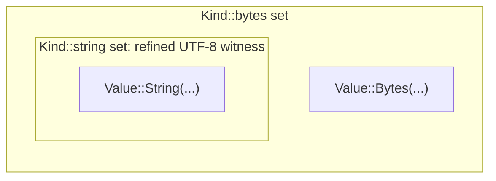

# RFC 2026-05-01 - Add `Value::String` Variant for Guaranteed-UTF-8 Strings

## Context

The `Value` enum in [src/value/value.rs](../src/value/value.rs) currently uses a single `Bytes(bytes::Bytes)` variant for both raw byte data and UTF-8 strings. This works but conflates two distinct concepts:

1. **Raw byte sequences** -- produced by network reads, decryption, random-bytes generation, binary protocol fields, and the output of compression/encryption functions. May or may not be valid UTF-8.
2. **Guaranteed-UTF-8 strings** -- produced by VRL source string literals, JSON deserialization, structured-log and key-value parsers that validate their input, grok captures, and functions whose output is valid UTF-8 by construction (hex, base64-encoded text, text-encoded hash digests, UUIDs, casing operations).

Conflating them has costs:

- Every operation that wants to treat a value as a string must perform a UTF-8 validation pass, even when the value provably came from a UTF-8 source.
- The type system (via `Kind`) cannot distinguish "raw bytes that might or might not be UTF-8" from "definitely a UTF-8 string", so fallibility analysis on operations that require UTF-8 is uniformly conservative.

This RFC proposes adding a new `Value::String(bytestring::ByteString)` variant alongside `Value::Bytes(Bytes)`, threading guaranteed-UTF-8 sources to the new variant, and (in later phases) lifting the distinction into the `Kind` type system. The change is staged across phases so each compiles and tests independently.

The [`bytestring`](https://crates.io/crates/bytestring) crate provides a `ByteString` type that wraps `bytes::Bytes` with a UTF-8 invariant -- zero-copy clones, cheap `as_str()`, and direct conversion from/to `Bytes` for interop with the existing variant.

## Goals

1. Improve the performance of UTF-8 string handling in `Value` by eliminating major classes of UTF-8 validation after bytes creation. Once a value is constructed from a guaranteed-UTF-8 source (parser literal, JSON deserialize, grok capture, parsed log/KV field from a UTF-8-validating parser, hex/base/hash output), subsequent `as_str` / display / serde / string-operation paths should be O(1) rather than re-running `from_utf8` or `from_utf8_lossy` (the more expensive of the two) on every call.
2. Preserve VRL `==` semantics: `Value::Bytes(b"foo") == Value::String("foo".into())` continues to hold (and they hash identically), so user programs see no behavior change at the equality layer.
3. Allow incremental adoption: each phase compiles standalone, tests pass at every phase boundary, and downstream consumers (notably Vector) can absorb the change without coordinated rollouts.
4. Ultimately let the type system prove "this kind has a UTF-8 witness" so operations that require UTF-8 can be infallible when that proof is available.
5. Preserve VRL program-level semantics: at the runtime/value level, byte-equal values remain `==`/`Hash`-equivalent regardless of variant, and the `is_bytes()` accessor on `Value` continues to admit both variants. Downstream Rust source-and-silent breaks from adding the variant are documented in Phase A.

## Out of scope

1. **Removing the `Value::Bytes` variant.** Raw byte data is real (decryption output, random bytes, binary protocol fields, compression output) and continues to need a representation.
2. **Automatic UTF-8 promotion at runtime.** This RFC never silently validates `Value::Bytes` content to opportunistically promote it to `Value::String`. Promotion is always explicit (Phase A `From<&str>` redirections and the new `Value::from_utf8_or_bytes` constructor, Phase B producer migrations).
3. **VRL surface-language type syntax changes.** The user-visible "string" type label is preserved.
4. **Performance benchmarking and tuning.** This RFC focuses on correctness and code structure. Benchmarks that quantify the win from skipping UTF-8 validation are future work.
5. **External consumer (Vector) coordination beyond Phase A's downstream audit.** Running that audit and fixing matches is left to each consumer. Deeper Vector integration (e.g. emitting `Value::String` from Vector source code) is left to a follow-up.

## Proposal

### Overview

Phase A delivers the new variant and threads UTF-8 sources to it; both variants share `Kind::bytes()`. Phase B incrementally migrates the remaining UTF-8-producing sites to emit `Value::String`. Phase C introduces a `string` flag on `Kind` as a refinement of `bytes` (the type system can prove UTF-8).

### Rationale

- **Coexist, don't replace.** `Bytes` and `String` are both first-class. Existing code keeps working.
- **Custom `PartialEq` keeps VRL semantics.** Without it, `Value::Bytes(b"foo") != Value::String("foo")` would break hundreds of equality sites and surprise users.
- **`try_bytes` chokepoint, plus a direct-match audit.** A single helper in [src/compiler/value/convert.rs](../src/compiler/value/convert.rs) is used by many callers to extract bytes. Updating it to accept both variants covers those callers transparently. A separate audit covers every site in this crate that destructures `Value::Bytes(_)` directly; each such match needs a sibling `Value::String(s)` arm before `From<&str>` and VRL literals can safely route to the new variant.
- **Refinement, not disjoint.** Adding `Kind::string` as a refinement of `Kind::bytes` (Phase C) is non-breaking: `is_bytes()` still admits both variants.

### Phase A -- Core: introduce `Value::String`

Phase A delivers the new variant end-to-end so the codebase compiles and tests pass with `Value::String` populated by the natural UTF-8 sources. No `Kind` changes; both variants map to `Kind::bytes()`.

The new variant is `Value::String(bytestring::ByteString)`. Custom `PartialEq` / `Eq` / `Hash` / `PartialOrd` treat `Bytes` and `String` of equal byte content as equal, identically hashed, and ordered by content -- not by discriminant. All other variants keep their current behavior.

Construction routing:

- `From<&str>`, `From<String>`, `From<Cow<'_, str>>`, `From<KeyString>`, and `From<ByteString>` produce `Value::String`.
- `From<Bytes>` and the byte-slice `From`s keep producing `Value::Bytes`. Callers holding UTF-8 `Bytes` opt in by wrapping a `ByteString`, or via the infallible `Value::from_utf8_or_bytes` constructor (valid UTF-8 → `String`, otherwise `Bytes`; zero-copy either way).
- VRL string and template-string literals (UTF-8 by the lexer) construct `Value::String`.
- Serde honors the source format: string visitors → `Value::String`; byte visitors → `Value::Bytes`.

String concat (arithmetic `+` and `Value::merge`): `String + String` → `String`; any mixed pair → `Bytes`. String repeat preserves the operand's variant. Comparisons are byte-wise across variants. Display of `Value::String` is byte-identical to Display of valid-UTF-8 `Value::Bytes`.

**Backwards compatibility.** VRL programs see no behavior change: `==` still holds across origins, `is_bytes()` on `Value` admits both variants, and `"foo" + null` still concatenates. Chokepoint helpers (`try_bytes`, `is_bytes`, and the other string-extracting accessors) accept either variant, so callers that already go through them keep working.

Adding a variant to `Value` (a public enum without `#[non_exhaustive]`) is not free for downstream Rust consumers. It is a compile-time break at exhaustive `match`, and a silent semantic break at non-exhaustive checks (`if let Value::Bytes(_)`, `matches!(..., Value::Bytes(_))`, ad-hoc predicates): those keep compiling but skip every value that arrived as `Value::String`, which after Phase A includes most VRL literals, JSON strings, and parser outputs. Consumers must add `Value::String` arms *and* audit every non-exhaustive `Value::Bytes` check -- either switch to an accessor that already accepts both variants, or add a sibling arm.

**Compatibility hazards** (missing one breaks tests or silently changes behavior):

1. Direct `Value::Bytes` matches that do not go through `try_bytes` must accept `Value::String` too, or they start failing once `From<&str>` and literals route to the new variant.
2. Display must keep escaping `\`, `"`, and newlines; writing the contained `&str` raw would fail snapshot tests.
3. Arithmetic special cases that treat `Bytes + Null` / `Null + Bytes` as no-op concat need the same behavior for `String`.
4. Downstream exhaustive matches (compiler-caught) and non-exhaustive variant checks (not compiler-caught), as above.

The VRL changelog for the Phase A release ships this guidance with worked examples drawn from Vector.

### Phase B -- Migrate UTF-8 producers to `Value::String` (incremental)

By Phase B, every VRL function already accepts `Value::String` input. This phase only tightens output construction. It is incremental: each producer can land as its own PR, and the phase can stop at any point as unmigrated producers keep emitting `Value::Bytes`.

Triage each function that constructs `Value::Bytes` into one of four classes:

1. *Top-level UTF-8 string producers.* Output is guaranteed UTF-8 by construction (case folding, truncation, hex/base/UUID, text-encoded hashes). Migrate to `Value::String`.
2. *Aggregate containers with UTF-8 string elements.* Arrays/objects whose contained strings are UTF-8 by construction. Top-level kind unchanged; per-element construction migrates.
3. *Raw-bytes producers.* Arbitrary bytes, not guaranteed UTF-8 (crypto, random bytes, compression, binary decode including base64, unvalidated passthrough, byte-index slicing). Stay on `Value::Bytes`.
4. *Mixed / non-string output.* Union return types or non-string output. The declared `TypeDef` stays as-is; individual UTF-8 construction sites may migrate.

The class boundary is "is this output guaranteed UTF-8 *today*, before we change anything?" Uncertain functions stay on `Value::Bytes` until verified.

**Backwards compatibility.** No public-API changes and no VRL-language changes. Runtime `==` continues to cross variants, so migrating a producer does not change user-visible equality.

### Phase C -- `Kind::string` as a refinement of `Kind::bytes`

Phases A-B left both variants sharing `Kind::bytes()`. Phase C adds a `string` flag that means "this kind has a UTF-8 witness" without removing `bytes`. `Kind::string` is a subset of `Kind::bytes`:


```mermaid
flowchart LR
  subgraph kbytes [Kind::bytes set]
    subgraph kstring [Kind::string set: refined UTF-8 witness]
      vstring["Value::String(...)"]
    end
    vbytes["Value::Bytes(...)"]
  end
```

The refinement invariant: `string` implies `bytes`. `Kind::string()` sets both flags; `From<&Value> for Kind` maps `Value::String` → `Kind::string()` and `Value::Bytes` → `Kind::bytes()`. Existing `is_bytes()` / `contains_bytes()` keep their meaning -- they check the `bytes` flag -- so existing call sites and the concat-infallibility check continue to work. New predicates: `contains_string()` (the flag is set) and `is_only_string()` (the kind is exactly the refined string). `is_superset` is directional: `Kind::bytes()` is a superset of `Kind::string()`, not vice versa; treating the flags symmetrically (or checking only `bytes`) makes the refinement unsound.

User-facing `Display` still renders `"string"` for both refined and unrefined kinds. The refinement may surface in `Debug`.

Merge preserves OR for `bytes`. The refinement is dropped only when *both* sides could produce string-y values and at least one is unrefined:

```
merged.bytes  = a.bytes  || b.bytes
merged.string = match (a.bytes, b.bytes) {
    (None,    None)    => None,          // neither branch is string-y
    (Some(_), None)    => a.string,      // only a is string-y; preserve a's refinement
    (None,    Some(_)) => b.string,      // only b is string-y; preserve b's refinement
    (Some(_), Some(_)) => a.string && b.string,  // both string-y; survive only if both refined
}
```

A refinement survives a merge iff every branch that contributes to the base flag also carries the refinement. String concat follows the same rule: both `is_only_string()` → `Kind::string()`; any other string-like combination → `Kind::bytes()`. Repeat preserves the operand's refinement. Comparisons still require only `is_bytes()`.

Output `TypeDef` tightening is optional and incremental: class 1 outputs become `Kind::string()`; class 2 tightens contained string kinds; classes 3–4 unchanged. Inputs need no change because `is_bytes()` still admits both.

`string!` remains a bytes-tag check, not a UTF-8 validator: it stays infallible when the input `is_bytes()` (both variants, including unrefined `Kind::bytes()`), and a bytes passthrough stays `Kind::bytes()`. `to_string` keeps its existing array/object/regex fallibility rule; its bytes passthrough stays unrefined, while paths that construct UTF-8 (integer/float/boolean/timestamp/null) or passthrough an `is_only_string()` input may tighten to `Kind::string()`. Operations that actually require a UTF-8 witness are infallible only when the input `is_only_string()` -- `contains_string()` is too permissive (`Kind::string() | Kind::null()` keeps the refinement but still errors on null).

**Backwards compatibility.** Zero source changes for VRL programs or external Rust consumers -- `is_bytes()` is the linchpin. The Phase A variant-addition cost is already paid. Test fixtures are *not* automatically compatible: `Kind::PartialEq` is structural, so a refined-string `TypeDef` will not equal `Kind::bytes()`. The test framework needs a way to write `Kind::string()` in fixtures; each output tightening is paired with its fixture update; untightened functions keep existing fixtures.

## Alternatives

### Stop after Phase B -- never touch `Kind`

Deliver Phases A-B only: introduce `Value::String`, route UTF-8 producers, tighten function outputs; both variants continue to map to `Kind::bytes()` indefinitely. This captures the runtime efficiency wins (skip-validation in hot paths) without any type-system churn. Rejected as the final stopping point because it forfeits the type-system fallibility wins -- operations that require UTF-8 remain uniformly fallible regardless of how the value was produced, and the compiler cannot statically prove UTF-8 even when the variant carries the witness. Phase C is non-breaking and modestly scoped, so the cost-benefit clearly favors including it.

### Make `Bytes(b"x")` and `String("x")` compare unequal at the value level

Keep the derived `PartialEq`/`Hash` on `Value` so distinct variants are always unequal even with identical byte content. Rejected because hundreds of existing test sites and an unknown number of user-facing VRL programs rely on equality working uniformly across sources -- Phase A's transition would break every fixture that uses `Value::from("foo")` (now `Value::String`) but compares against a value that arrived as `Value::Bytes` (e.g. through a deserialize path that wasn't yet re-routed). The user-visible failure mode -- `"foo" == "foo"` becoming false depending on origin -- is unacceptable. Custom `PartialEq` and `Hash` (so byte-equal values hash identically) is the only way to keep VRL `==` semantics uniform across the variant split.

### Keep VRL string literals as `Value::Bytes`

Stop short of changing [src/compiler/expression/literal.rs](../src/compiler/expression/literal.rs) and [src/compiler/compiler.rs](../src/compiler/compiler.rs); only library-internal sources (JSON deserialize, grok, parsers) emit `Value::String`. Rejected because VRL literals are guaranteed UTF-8 by the lexer and are the cheapest, highest-impact source -- emitting them as `Value::String` propagates the refinement to user-written string ops automatically. With this alternative, `"foo" + parse_json!(input).field` would produce `Value::Bytes` even when the right side is `Value::String`, dropping the refinement Phase C wants to track and starving the new variant of its most natural input.

## Implementation plan

One checkbox per planned PR. Later PRs depend on earlier ones in listed order.

- [ ] Phase A -- Add `Value::String(ByteString)` variant. Single PR landing the new variant, custom `PartialEq`/`Hash`, conversions, display, serde, arithmetic, parser-literal routing, the `try_bytes` chokepoint update, and the direct-match audit (every `Value::Bytes(_)` arm in this crate gains a sibling `Value::String(_)` arm or is rewritten to use `try_bytes`). Must land atomically -- intermediate states will not compile, and tests will only pass once the audit is complete. Downstream consumer migration (compile-time *and* silent-semantic): every consuming crate, notably Vector, must (a) add `Value::String(_)` arms to exhaustive matches and (b) audit every non-exhaustive `Value::Bytes` pattern (`if let`, `matches!`, custom predicates) and decide whether to accept the new variant. Ship changelog guidance and the recommended `rg` query.
- [ ] Phase B -- Migrate UTF-8 producers to `Value::String` (incremental). Per-function audit triages each function returning `Value::Bytes` into one of four classes (top-level UTF-8 producer, aggregate container with UTF-8 elements, raw-bytes producer, mixed/non-string output); classes 1 and 2 migrate, classes 3 and 4 stay. Each producer (or small group) can land as its own PR; the phase can stop at any point without rolling back. No public-API changes.
- [ ] Phase C -- Add `Kind::string` as a refinement of `Kind::bytes`. Single PR landing the `string` flag with `string => bytes` canonicalization invariant, the refinement-aware merge rule (refinement survives unless a string-y branch is unrefined), directional `is_superset` (`bytes` is a superset of `string`, not vice versa), new predicates (`contains_string`, `is_only_string`), infallibility wins on operations that require a UTF-8 witness when the input `is_only_string()`, and a `vrl_test_framework` syntax extension for asserting refined-string `TypeDef`s. Output `TypeDef` tightening is opt-in per function and paired with the corresponding fixture update in the same change -- passthrough-bytes outputs stay unrefined. Backwards-compatible for any function whose output is not tightened.

## Future work

- **Disjoint `Kind::bytes` / `Kind::string` (breaking change).** This RFC stops at Phase C's refinement (`string` implies `bytes`; `is_bytes()` still admits both). A later major-version migration could make the two kinds disjoint: `Kind::string()` would set only the `string` flag, `Kind::string_like()` (`bytes | string`) would become the usual function parameter type, `is_bytes()` would mean raw bytes only, and VRL programs would need explicit `assert_string!` casts. Value-level `==` would stay structural over byte content (crossing the kind boundary); diagnostics would render `"bytes"` and `"string"` as distinct labels. Automatic UTF-8 widening at runtime would stay out of scope. The team can remain on Phase C indefinitely if the breaking change is unwelcome.
- **Performance benchmarking.** Quantify the win from skipping UTF-8 validation in hot paths (logging pipelines, JSON-heavy transforms). Phases A-B give a reasonable baseline; Phase C's skip-validation on UTF-8-requiring operations is the most likely place to see measurable gains.
- **Vector integration.** Have Vector emit `Value::String` from its source code where appropriate (e.g. log message fields parsed from UTF-8 inputs). Out of scope for this RFC.
- **Per-function migration tracking.** Phase B is incremental; a tracking issue listing which functions have been migrated would help coordinate the work.
- **Schema integration.** Vector's config-time schema/type checking (currently keyed on `Kind::bytes`) could be tightened to `Kind::string` for fields that are documented as strings, gaining stronger config validation.
- **Direct `bytes::Bytes <-> ByteString` conversions** in performance-critical paths to avoid round-tripping through `Vec<u8>`.

## References

- [`bytestring` crate](https://crates.io/crates/bytestring) -- UTF-8 wrapper around `bytes::Bytes`.
- [`bytes` crate](https://crates.io/crates/bytes) -- current `Value::Bytes` storage.
- [src/value/value.rs](../src/value/value.rs) -- current `Value` enum definition.
- [src/value/kind.rs](../src/value/kind.rs) -- current `Kind` type system.
- [src/compiler/value/convert.rs](../src/compiler/value/convert.rs) -- `VrlValueConvert::try_bytes` chokepoint used to extract bytes.
- [src/compiler/value/arithmetic.rs](../src/compiler/value/arithmetic.rs) -- runtime `+`, `*`, comparison ops on string values.
- [src/compiler/expression/op.rs](../src/compiler/expression/op.rs) -- type-level infallibility analysis for arithmetic.
- [src/compiler/expression/literal.rs](../src/compiler/expression/literal.rs) -- VRL string literals (currently produce `Value::Bytes`).
